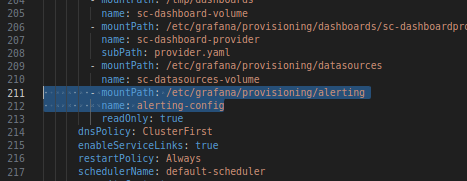
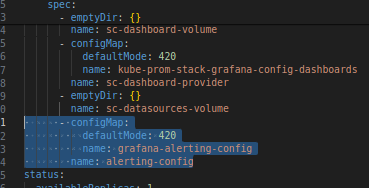

How to Import grafana managed alerting rules that we were previously created on grafana and exported in yaml file

Step 1 : Edit grafana deploymet and add below lines ; basically we are going to mount that exported yaml file in /etc/grafana/provisioning/alerting directory using configmap

Under volume mount

```python
        - mountPath: /etc/grafana/provisioning/alerting
          name: alerting-config
```

It will look like this ,



under volumes :

```python
      - configMap:
          defaultMode: 420
          name: grafana-alerting-config
        name: alerting-config
```


- save and exit

Step 2 . create grafana-alerting-config configmap. add your exported yaml file in that then apply that yaml file.

see , [grafana-alerting-rule-cm.yaml ](grafana-alerting-rule-cm.yaml)  for example 

-------------------

